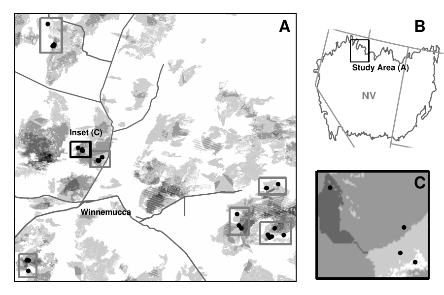

```{r setup, include=FALSE}
knitr::opts_chunk$set(echo = TRUE, message = FALSE, warning = FALSE)
```

# If you would like to follow along in R:

clone this repo: https://github.com/admahood/ff_study

i.e.

`git clone https://github.com/admahood/ff_study.git`

This presentation has all the code, is called `eds_talk.Rmd`

# Then, install these packages (and load them):

```{r}
# for the actual analysis
library(tidyverse)
library(Hmsc)
require(snow)

# for the aesthetics
library(ggtext)
library(knitr)
library(kableExtra)
library(ggpubr) # for ggarrange
```

I will begin with some background, so people who want to follow along will be able to get caught up on all that stuff

# Cheatgrass, Sagebrush, Fires, oh my!

{ width=75% }

They look the same but are they really the same?

# Remote sensing based sampling design

{ width=75% }

# Effect of fire frequency on biodiversity

{ width=75% }

# Fires and diversity

{ width=75% }

# Fires and diversity - multivariate analysis of community composition

* So, the diversity indexes were pretty clear, but the community composition is harder to understand

{ width=75% }

* The dispersion is hard to interpret (3's are really close together, 1's and 2's less so, implying less similar community composition)

# Fires and diversity - multivariate analysis of community composition

{ width=75% }

* what are we not seeing here?
  * Shrubs in FF1 & 2 are mostly rabbitbrush (*Ericameria spp*) instead of sagebrush

# Enter Joint Species distribution modelling


# Modelling every species, accounting for residual correlation


# Different types of JSDMs


# Different types of JSDMs


# Heirarchical Modelling of Species Communities (HMSC)

figure from HMSC

# Basic data input

```{r}
div_wide <- read.csv("Data/FF_All_plots.csv") %>%
  dplyr::select(-SS1, -SS2,-Seedlings) %>%
  mutate(Plot = substr(Image,1,9)) %>%
  mutate(UNK9 = UNK2 + UNK9) %>% # UNK2 = UNK9!
  mutate(LEPE2 = LEPE2 + LEPE2.1) %>%
  dplyr::select(-UNK2, -Image, -LEPE2.1) %>%
  dplyr::rename(CYMOP2 = CYMO,
                BAPR5 = BAPR,
                ERNA10 = ERNA,
                CRYPT = CRYPTANTHASP,
                ELCA13 = ELCA,
                ACMI2 = ACMI) %>%
  group_by(Plot) %>%
  summarise_all(mean, na.rm=TRUE) %>%
  dplyr::select(-ssMean, -LITTER, -BARE, -SHADOW,-Seedling_presence,
                -UNCLEAR, -WOOD, -SCAT, -DUNG, -ROCK,-CRUST) %>%
  dplyr::arrange(Plot) %>%
  tibble::column_to_rownames("Plot")


ENV <- read.csv("Data/FF_All_plots.csv") %>%
  dplyr::select(Image, ssMean, Seedlings, Seedling_presence, LITTER, BARE, ROCK,
                CRUST, SHADOW, UNCLEAR, WOOD, SCAT, DUNG) %>%
  mutate(plot = substr(Image, 1, 9)) %>%
  dplyr::select(-Image) %>%
  group_by(plot) %>%
  summarise_all(mean, na.rm=TRUE) %>%
  mutate(Seedling_presence = as.factor(ifelse(Seedling_presence >0, "present", "absent")))


env_data <- read.csv("Data/FF_plot_level.csv") %>%
  dplyr::rename(plot = X)%>%
  mutate(burned = as.factor(ifelse(FF == 0, "unburned", "burned")),
         soil_carbon_gm2 = Soil_BD * Soil_OM * 100,
         soil_nitrogen_gm2 = Soil_BD * Soil_TN * 100,
         BRTE_carbon_gm2 = BRTE_mass/.9 * BRTE_TC/100,
         BRTE_nitrogen_gm2 = BRTE_mass/.9 * BRTE_TN/100,
         Soil_ag_stab = ENV$ssMean,
         FF=as.factor(FF),
         Seedling_presence = as.factor(Seedling_presence),
         exotic_cover = EAF + EAG + EPF + EPG,
         native_cover = NAF + NPF + NPG + shrub_cover_PQ,
         adj_TSF = ifelse(is.na(TSF)==TRUE, 100, TSF),
         block = substr(plot, 1, 3),
         block = as.factor(ifelse(block == "F03", "F05", block))
  ) %>%
  dplyr::select(FF,BRTE_TN, BRTE_TC, Soil_BD, Soil_OM, Soil_TN,plot,
                netMineralization, Elevation, folded_aspect, AUM_acre,
                soil_carbon_gm2, soil_nitrogen_gm2, Soil_ag_stab,burned
  ) %>% 
  left_join(ENV) %>%
  arrange(plot) 

```

# Hmsc-specific data wrangling

```{r}
Y <- div_wide %>%
  as.matrix
Y[Y>0] <-1

# We can do abundance by saying Y <- Y/100

prevalence<- colSums(Y) %>%
  as_tibble(rownames = "Species") %>%
  dplyr::rename(prevalence = value) %>%
  arrange(desc(prevalence))

XData <- env_data %>%
  mutate(site = str_sub(plot, 1,3)) %>%
  dplyr::select(-starts_with(c("BRTE", "Soil_", "net", "soil_")))%>%
  mutate(plot = as.factor(plot)) %>%
  tibble::column_to_rownames("plot")%>%
  mutate_if(is.character, as.factor) %>%
  as.data.frame() 
```

# Model Setup

```{r}
XFormula <- ~ Elevation+
  folded_aspect +
  FF +
  LITTER +
  AUM_acre

# insert traits here

studyDesign <- data.frame(site = as.factor(XData$site))
rL <- HmscRandomLevel(units = studyDesign$site)

mod = Hmsc(Y = Y, XData = XData, XFormula = XFormula, distr="probit",
           #TrData = traits,
           #TrFormula = tr_form,
           studyDesign = studyDesign,
           ranLevels = list("site" = rL))
```

# MCMC setup

```{r mcmc_setup}
nChains = 2
test.run = TRUE
if (test.run){
  #with this option, the vignette evaluates in ca. 1 minute in adam's laptop
  thin = 10
  samples = 100
  transient = ceiling(thin*samples*.5)
}else{
  # with a spatial random effect, evaluates in ---
  # looks like a compute-optimized aws instance is called for, very little ram usage
  thin = 100
  samples = 1000
  transient = ceiling(thin*samples*.5)
}
```

# The business

This stuff takes a long time! It's a really good idea to keep track of how long things take, and save your results.

```{r mcmc_run}
t0 <- Sys.time()
# hmsc_file <- "Data/hmsc/hmsc_probit_test.Rda"
dir.create("Data/hmsc")
# if(!file.exists(hmsc_file)){
  m = sampleMcmc(mod, thin = thin, 
                 samples = samples, 
                 transient = transient,
                 adaptNf = rep(ceiling(0.4*samples*thin),1),
                 nChains = nChains, 
                 nParallel = nChains)
  print(Sys.time()-t0)
#   save(m, file=hmsc_file)
# }else{load(hmsc_file)}
```


# getting the different results

```{r}
mpost <- convertToCodaObject(m) # model diagnostics/ convergence
preds = computePredictedValues(m) # model performance
MF = evaluateModelFit(hM=m, predY=preds) # getting some r2, etc
VP <- computeVariancePartitioning(m) # variance partitioning

```

# model convergence, diagnostics


```{r}
psrf.V = gelman.diag(mpost$V,multivariate=FALSE)$psrf%>%
  as_tibble() %>% dplyr::rename(psrf_v = `Point est.`)


ess.beta <- effectiveSize(mpost$Beta) %>%
  as_tibble() %>% dplyr::rename(ess_beta = value)

ess.v <- effectiveSize(mpost$V)%>%
  as_tibble() %>% dplyr::rename(ess_v = value)
psrf.beta <- gelman.diag(mpost$Beta, multivariate=FALSE)$psrf%>%
  as_tibble() %>% dplyr::rename(psrf_beta = `Point est.`)

diag_all <- ggarrange(ggplot(ess.beta, aes(x=ess_beta)) + 
                        geom_histogram()+
                        xlab("Effective Sample Size"),
                      ggplot(psrf.beta, aes(x=psrf_beta)) +
                        geom_histogram()+
                        xlab("Gelman Diagnostic"),
                      align = "v") +ggtitle("All Plots")

ggsave(diag_all,filename = "figures/geldman_ess.pdf", width = 5.5, height=3.5, bg="white")

diag_all
```

ESS should be around 400, Gelman <1.001

{ width=75% }

```{r}
MF$TjurR2 %>% mean(na.rm=T)


data.frame(species = colnames(Y),TjurR2 = MF$TjurR2  ) %>%
  dplyr::arrange(desc(TjurR2)) %>%
  knitr::kable() %>%
  kableExtra::kable_styling()
# explanatory power

ggarrange(
  ggplot(as.data.frame(MF),aes(x=(RMSE))) + geom_histogram(),
  ggplot(as.data.frame(MF),aes(x=(TjurR2))) + geom_histogram(),
  ggplot(as.data.frame(MF),aes(x=(AUC))) + geom_histogram())
```


# $R^2$ vs prevalence


```{r}
mf_df <- data.frame(Species = colnames(m$Y),
                    R2 = MF$TjurR2,
                    AUC = MF$AUC,
                    RMSE = MF$RMSE) %>%
  left_join(prevalence)

mean(mf_df%>% filter(prevalence>7) %>% pull(R2), na.rm=T)
ggplot(mf_df, aes(x=prevalence, y=RMSE)) +
  geom_point()
```

# variance partitioning

```{r}
sbquants <- summary(mpost$Beta)$quantiles %>%
  as_tibble(rownames = "variable") %>% 
  mutate(sign = `2.5%` * `97.5%`) %>%
  filter(sign>0) %>%
  separate(variable,
           into = c("variable", "species"),
           sep = ",") %>%
  mutate(variable = str_sub(variable, 3,nchar(variable)-5),
         species = str_sub(species, 2,nchar(species)-6) %>% trimws) %>%
  filter(variable!= "(Intercept)") %>%
  dplyr::select(variable,species,`2.5%`,`50%`,`97.5%`) %>%
  arrange(variable)


vp_df <- VP$vals%>%
  as_tibble(rownames = "variable") %>%
  pivot_longer(cols=names(.)[2:ncol(.)], 
               names_to = "Species", 
               values_to = "value") %>%
  left_join(prevalence) %>%
  na.omit()

vp_summary <- vp_df %>%
  group_by(variable) %>%
  summarise(value = mean(value)) %>%
  ungroup() 

vp_order <- vp_df %>%
  filter(variable == "Random: site") %>%
  arrange(prevalence) %>%
  mutate(Species_f = factor(Species, levels = .$Species)) %>%
  dplyr::select(Species, Species_f) 

# 
# vp_order <- vp_df %>% filter(variable == "Random: sample") %>%
#   filter(origin=="I") %>%
#   left_join(prevalence) %>%
#   arrange(prevalence, origin) %>%
#   mutate(Species_f = factor(Species, levels = .$Species)) %>%
#   dplyr::select(Species, Species_f, origin) %>%
#   rbind(vp_order_n)# %>%
#   #left_join(mf_df)


vp <- left_join(vp_df, vp_order) %>% 
  ggplot(aes(x=value,y=Species_f, fill = variable)) +
  geom_bar(stat="identity")+
  theme_classic() +
  ylab("Species") +
  xlab("Proportion of Variance Explained") +
  scale_fill_brewer(palette = "Dark2")+
  theme(legend.position = c(1,.315),
        legend.text = element_markdown(),
        legend.title = element_blank(),
        legend.justification = c(1,0),
        legend.background = element_rect(color="black")) +
  ggtitle("Variance Partitioning, Occurrence Model")

ggsave(vp, filename="figures/variance_partitioning_occurrence.png", height = 11.5, width = 9)
vp
```

# species niches

or, how are species responding to environmental drivers

```{r}

postBeta <- getPostEstimate(m, parName = "Beta")

means <- postBeta$mean %>%
  as_tibble() %>%
  rowid_to_column("env_var") %>%
  mutate(env_var =c("intercept",  "Elevation","folded_aspect" ,"FF1",  "FF2", "FF3", "Litter", "AUM_acre")) %>%
  pivot_longer(cols=names(.)[2:ncol(.)], names_to = "Species", values_to = "Mean")

supported <- postBeta$support %>% 
  as_tibble() %>%
  rowid_to_column("env_var") %>%
  mutate(env_var = c("intercept",  "Elevation","folded_aspect" ,"FF1",  "FF2", "FF3", "Litter", "AUM_acre")) %>%
  pivot_longer(cols=names(.)[2:ncol(.)], 
               names_to = "Species", 
               values_to = "Support") %>%
  filter(Support >0.95|Support<0.05,
         env_var != "intercept") %>%
  left_join(means, by = c("env_var", "Species"))%>%
  mutate(sign = ifelse(Mean>0, "+", "-"))#%>%
  # left_join(vp_order_n)

p_beta<- ggplot(supported, aes(x=env_var,y=Species, fill = Mean, color = sign)) +
  geom_tile(lwd=.5) +
  theme_classic()+
  scale_fill_steps2(mid = "grey90") +
  scale_color_manual(values = c(("red"), ("blue"))) +
  guides(color = "none")+
  theme(axis.text.x = element_text(angle=45, vjust=1,hjust = 1),
        axis.title = element_blank())
ggsave(p_beta,filename = "figures/betas_binomial.png", bg="white")


p_beta
plotBeta(m, post = postBeta, param = "Support",
         supportLevel = 0.95, split=.4, spNamesNumbers = c(T,F))

```

# gradient visualization - Continuous variable

```{r}
gradient = constructGradient(m, focalVariable = "LITTER",
                             non.focalVariables = 1)

predY_LITTER = predict(m, XData=gradient$XDataNew, expected=TRUE, 
                       studyDesign=gradient$studyDesignNew,
                       ranLevels=gradient$rLNew)

n_runs <- nChains*samples

pred_df <- do.call("rbind", predY_LITTER) %>%
  as_tibble() %>%
  mutate(LITTER = rep(gradient$XDataNew$LITTER,
                                 n_runs),
         run = rep(1:n_runs,each=20)) %>%
  pivot_longer(values_to = "cover", names_to = "Species", -c(LITTER,run)) %>%
  left_join(prevalence) %>%
  filter(prevalence > 1) %>%
  arrange(desc(prevalence)) %>%
  mutate(Species_f = factor(Species, levels = unique(.$Species))) 

grazing_native <- pred_df %>%
  ggplot(aes(x=LITTER, y=cover)) +
  geom_line(alpha = 0.03, aes(group=run), key_glyph="rect")+
  # geom_line(data = pred_df_grazing,
  #           lwd=1, alpha=0.95, color="black", aes(y=mean))+
  facet_wrap(~Species_f, nrow=4)+
  xlab("Litter Cover (Percent)") +
  ylab("Probability of Occurrence") +
  guides(color=guide_legend(override.aes = list(alpha=1)))+
  # scale_color_brewer(palette = "Dark2") +
  # scale_color_manual(values = pal_nat)+
  theme(legend.position = "right",
        strip.text = element_markdown(),
        panel.border = element_rect(fill=NA, size=0.75),
        legend.justification = c(1,0),
        legend.title = element_blank())

ggsave(grazing_native, filename = "figures/gradient_LITTER.png", width = 20, height = 10)
grazing_native

```

# gradient visualization - Categorical

```{r}
gradient = constructGradient(m, focalVariable = "FF")

predY_ff = predict(m, XData=gradient$XDataNew, expected=TRUE, studyDesign=gradient$studyDesignNew, 
                ranLevels=gradient$rLNew)

n_runs <- nChains*samples

pred_df_ff <- do.call("rbind", predY_ff) %>%
  as_tibble() %>%
  mutate(FF = rep(gradient$XDataNew$FF,
                                 n_runs),
         run = rep(1:n_runs, each=4)) %>%
  pivot_longer(values_to = "cover", names_to = "Species", -c(FF,run)) %>%
  left_join(prevalence) %>%
  filter(prevalence > 1) %>%
  arrange(desc(prevalence)) %>%
  mutate(Species_f = factor(Species, levels = unique(.$Species))) 

ff_native <- pred_df_ff %>%
  ggplot(aes(x=FF, y=cover)) +
  geom_jitter(alpha = 0.03, aes(group=run), key_glyph="rect")+
  # geom_line(data = pred_df_grazing,
  #           lwd=1, alpha=0.95, color="black", aes(y=mean))+
  facet_wrap(~Species_f, nrow=4)+
  xlab("Fire Frequency") +
  ylab("Probability of Occurrence") +
  guides(color=guide_legend(override.aes = list(alpha=1)))+
  # scale_color_brewer(palette = "Dark2") +
  # scale_color_manual(values = pal_nat)+
  theme(legend.position = "right",
        strip.text = element_markdown(),
        panel.border = element_rect(fill=NA, size=0.75),
        legend.justification = c(1,0),
        legend.title = element_blank())

ggsave(ff_native, filename = "figures/gradient_ff.png", width = 20, height = 10)
ff_native
```

